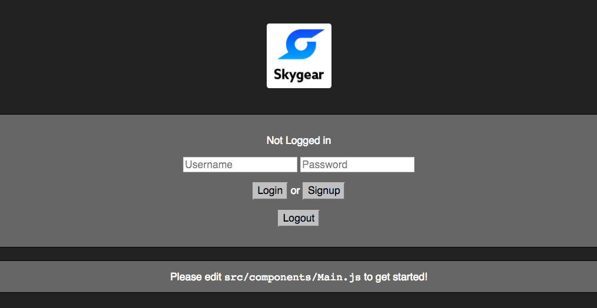

[Skygear](https://skygear.io) is a cloud backend for apps. It comes with SDKs for iOS, Android and Web.

## Scaffolding a React-Skygear app

This is a yeoman generator for a React-Skygear app. It extends [generator-react-webpack](https://github.com/react-webpack-generators/generator-react-webpack).

What's in the app:
- API and endpoint configuration
- User sign up/sign in with a simple UI.

Follow the steps below to create a React-Skygear app:

### Prerequisite

- Make sure you are using node5.0+ and npm3+
- Sign up an account at [Skygear.io](https://skygear.io) and get the server Endpoint and the API key of your Skygear app.

### Installing the app with yo

```bash
# Make sure both is installed globally
npm install -g yo
npm install -g generator-skygear
```

### Setting up the project

```bash
# Create a new directory, and `cd` into it:
mkdir my-new-project && cd my-new-project

# Run the generator
yo skygear
```
You will be asked to input the server endpoint and the api key of your app. You can get them from the [developer portal](https://portal.skygear.io/app/info) after creating an account at [Skygeario](https://skygear.io).

### Running the app

```bash
npm start
```

If you can see the following screen, it means you have set up the app successfully. :smile:



## Basic usage
The following commands are available for your project:

```bash
# Start for development
npm start # or
npm run serve

# Start the dev-server with the dist version
npm run serve:dist

# Just build the dist version and copy static files
npm run dist

# Run unit tests
npm test

# Auto-run unit tests on file changes
npm run test:watch

# Lint all files in src (also automatically done AFTER tests are run)
npm run lint

# Clean up the dist directory
npm run clean

# Just copy the static assets
npm run copy
```

For more advance usage and option detail, please refer to [README.md of
generator-react-webpack]
(https://github.com/react-webpack-generators/generator-react-webpack)

## Learn more about Skygear
As a next step you can check out the guides for [Skygear cloud database basics](https://docs.skygear.io/guides/cloud-db/basics/js/) and [Skygear user authentication basics](https://docs.skygear.io/guides/auth/basics/js/).
